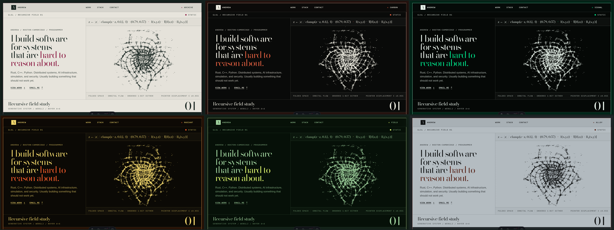

# Andrew / Minimal Signal

An alternate, editorial homepage for Andrew’s systems and AI portfolio. This
branch keeps the existing project and contact facts while replacing the former
terminal HUD with a full-viewport research-plate interface, ordered 1-bit
artwork, and one contained raw-WebGL2 recursive field.



## Run locally

Requires Bun 1.2.23. Deployment tooling is pinned to Node.js 22.x.

```bash
bun install
bun run dev
```

Open the URL Astro prints in the terminal.

## Verify

```bash
bun test
bun run build
bun run preview
```

The regression capture script expects a local preview at
`http://127.0.0.1:4325/` by default. Override it with
`PORTFOLIO_PREVIEW_URL` when needed.

```bash
bun run visual:regression
```

It captures all six 1280×720 hero palettes; complete `archive` and `carbon`
pages at 1440, 768, 390, and 320px widths; and desktop/mobile comparisons with
the live portfolio. The run also asserts one canvas, no horizontal overflow, and
CLS below 0.05.

## Implementation notes

- Palette choice persists to `portfolio.palette.v1` and is exposed through
  `html[data-palette]`.
- The hero fills the opening viewport beneath a fixed masthead. Its type and
  recursive field move subtly with page scroll before a wide paper card rises
  from the surrounding field.
- Desktop body scroll pins that card and translates the Work → Stack track
  through its clipped viewport. At the end, the paper card lifts away while a
  separate dark Contact scene fades in underneath it. There is no nested
  scrollbar or wheel capture.
- Mobile widths and reduced-motion preferences restore direct document flow,
  preserving the same Work → Stack → Contact order without pinned transforms.
- Every project is rendered directly with a three-step system flow and a
  project-specific plate. The earlier engravings remain low-contrast ambient
  artwork behind the page.
- `ENTITY_08`, the Solar Ghost Cartographer, is a static solar-organic
  cybernetic engraving inside Contact’s explicit specimen figure. It remains
  separated from the ambient engraving field; there is no roaming entity,
  cross-field overlap, animation runtime, or second canvas.
- `src/data/portfolio.ts` is the single typed source for project, stack,
  palette, and contact data.
- `src/scripts/recursive-field.ts` owns the only live canvas. It caps DPR and
  buffer size, adapts resolution, pauses offscreen or when hidden, renders one
  deterministic frame for reduced motion, and falls back to a pre-rendered
  poster for WebGL failure, data saver, or context loss.
- `scripts/generate-dither-assets.mjs` deterministically rebuilds four
  procedural study masks, four ambient engravings, four accurate project
  plates, the recursive poster, the `ENTITY_08` mask, and the optimized social
  card. The transparent art masks share one 4×4 Bayer pipeline.
- Licensed Bodoni Moda and IBM Plex Mono files and their OFL notices are
  self-hosted under `public/fonts/`.
- Original generated sources and unverified legacy watcher artwork live outside
  `public/` under `artwork-source/`.

This branch is a comparison artifact only; it does not deploy or alter the live
site by itself.
